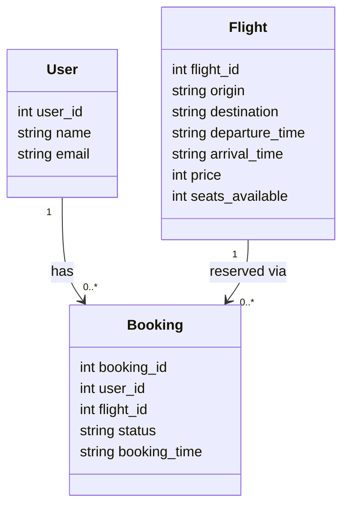
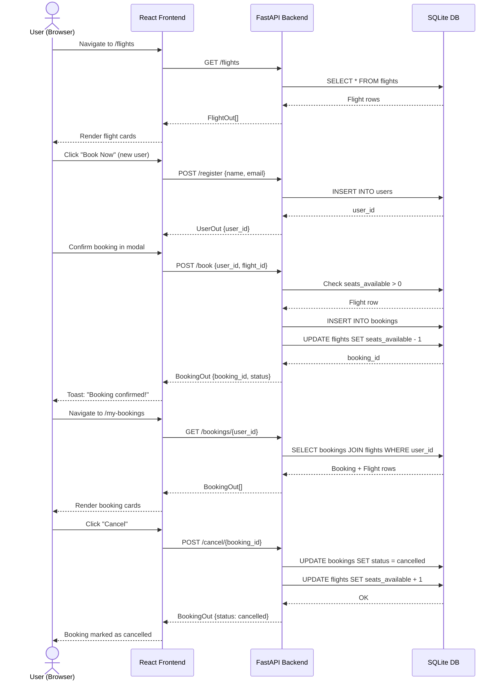

# Diagrams — Galaxium Travels

## Diagram 1 — Class Diagram

Domain models and their relationships, derived from `booking_system_backend/models.py`.

## Diagram 2 — Sequence Diagram

Main user booking flow: browse → identify → book → view → cancel.

