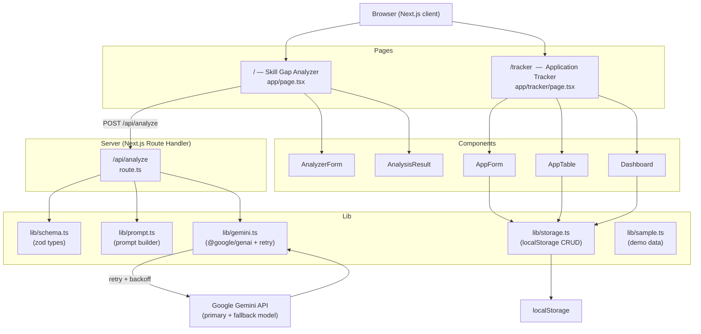

# JobGap

**Skill-gap analyzer & application tracker for fresh graduates**

---

## Problem

Youth unemployment in Indonesia (age 15–24) stands at **16.89%** (BPS, Aug 2025).
Fresh graduates send many applications with little response and often don't know
which skills they lack for a specific job. JobGap helps them find the gap — and
close it.

---

## Features

| Feature | Description |
|---|---|
| **Skill Gap Analyzer** | Upload or paste your CV + a job description. Gemini returns matched skills, missing skills with priority, and a learning plan (≤ 5 steps). Match score is computed server-side from the skill lists. |
| **Application Tracker** | Log every application (company, role, date, CV version, status). Change status inline. Delete rows. All data is stored in your browser's `localStorage`. |
| **Dashboard** | Overall response rate (responded + interview ÷ total) and a bar chart of response rate per CV version. |

Supports CVs written in **English or Indonesian**. UI is in English.

---

## Setup

### Prerequisites

- Node.js ≥ 18
- A [Gemini API key](https://aistudio.google.com/app/apikey) (free tier works)

### Steps

```bash
# 1. Clone and enter the project folder
git clone <repo-url>
cd jobgap

# 2. Install dependencies
npm install

# 3. Set env vars
cp .env.local.example .env.local   # or create .env.local manually
# Required:  GEMINI_API_KEY=<your-key>
# Optional:  GEMINI_MODEL=gemini-3.6-flash          (default)
#            GEMINI_FALLBACK_MODEL=gemini-2.0-flash-lite

# 4. Start the dev server
npm run dev
```

Open [http://localhost:3000](http://localhost:3000).

---

## Environment Variables

| Variable | Required | Description |
|---|---|---|
| `GEMINI_API_KEY` | ✅ Yes | Google Gemini API key. Never commit this value. |
| `GEMINI_MODEL` | No | Primary model name (default: `gemini-3.6-flash`). |
| `GEMINI_FALLBACK_MODEL` | No | Fallback model tried once if primary exhausts 3 retries (e.g. `gemini-2.0-flash-lite`). |

All variables must be placed in `.env.local` (git-ignored).
They are only read server-side inside `lib/gemini.ts`.

---

## Architecture



---

## Project Structure

```
jobgap/
├── src/
│   ├── app/
│   │   ├── layout.tsx          # Root layout + nav
│   │   ├── page.tsx            # Skill Gap Analyzer page
│   │   ├── tracker/
│   │   │   └── page.tsx        # Application Tracker page
│   │   └── api/
│   │       └── analyze/
│   │           └── route.ts    # Gemini server route
│   ├── components/
│   │   ├── AnalyzerForm.tsx
│   │   ├── AnalysisResult.tsx
│   │   ├── AppForm.tsx
│   │   ├── AppTable.tsx
│   │   └── Dashboard.tsx
│   ├── lib/
│   │   ├── schema.ts           # Zod schemas & TypeScript types
│   │   ├── prompt.ts           # Gemini prompt builder
│   │   ├── gemini.ts           # @google/genai client, retry, fallback
│   │   ├── storage.ts          # localStorage helpers
│   │   └── sample.ts           # Demo CV + JD text
│   └── __tests__/
│       ├── schema.test.ts
│       ├── gemini.test.ts
│       └── storage.test.ts
├── .env.local                  # API key (git-ignored)
└── README.md
```

---

## Running Tests

```bash
npm test
```

31 tests across four suites:

- `schema.test.ts` — zod `AnalyzeOutputSchema` (score range, priority enum, learning plan cap)
- `gemini.test.ts` — retry/backoff, 400 no-retry, fallback model, `GeminiBusyError`
- `storage.test.ts` — localStorage CRUD + response-rate logic
- `extract-cv.test.ts` — PDF/DOCX 400/422 validation + real DOCX fixture

---

## How IBM Bob Was Used

This project was built entirely through a conversation with **IBM Bob** (AI software engineer) using the *Agent* mode. Each task was handed off as a single focused instruction following the project's own rules:

| Session | Task given to Bob | Files touched |
|---|---|---|
| 1 | Scaffold the Next.js + TypeScript + Tailwind project, create placeholder files, verify `npm run dev` | `package.json`, all placeholder files, root layout |
| 2 | Implement zod schemas, Gemini prompt builder, and the `/api/analyze` route with retry logic | `lib/schema.ts`, `lib/prompt.ts`, `app/api/analyze/route.ts`, `__tests__/schema.test.ts` |
| 3 | Build the Analyzer UI — textareas, loading state, result view, error handling, "Try sample" button | `app/page.tsx`, `components/AnalyzerForm.tsx`, `components/AnalysisResult.tsx`, `lib/sample.ts` |
| 4 | Implement `localStorage` CRUD and the Application Tracker page with add-form and inline-edit table | `lib/storage.ts`, `lib/schema.ts`, `app/tracker/page.tsx`, `components/AppForm.tsx`, `components/AppTable.tsx` |
| 5 | Add dashboard summary — overall response rate stat + recharts bar chart per CV version | `components/Dashboard.tsx`, `app/tracker/page.tsx` |
| 6 | Write storage + response-rate tests; write this README | `__tests__/storage.test.ts`, `README.md` |

Bob was instructed to show a short plan before each implementation, touch only the files named in the task, and never rewrite whole files. The result is a fully working MVP delivered in six focused sessions with zero manual code edits.
