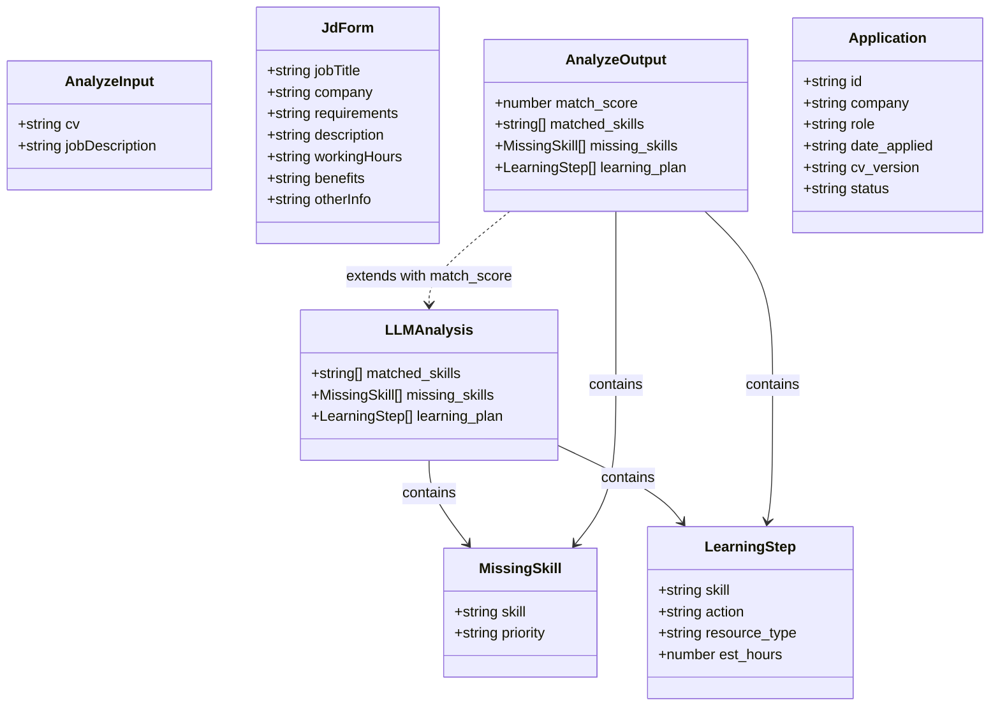
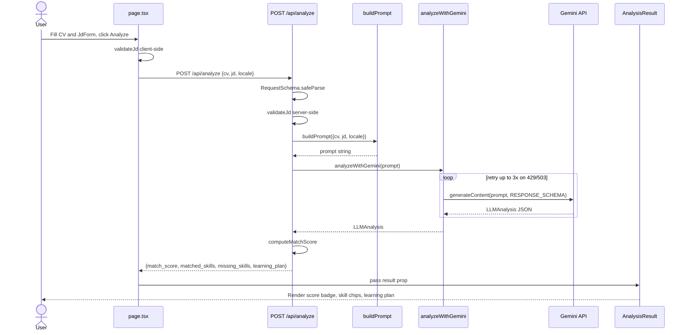

# Diagrams — JobGap

## Diagram 1 — Class Diagram

```mermaid
classDiagram
    class AnalyzeInput {
        +string cv
        +string jobDescription
    }
    class JdForm {
        +string jobTitle
        +string company
        +string requirements
        +string description
        +string workingHours
        +string benefits
        +string otherInfo
    }
    class MissingSkill {
        +string skill
        +string priority
    }
    class LearningStep {
        +string skill
        +string action
        +string resource_type
        +number est_hours
    }
    class LLMAnalysis {
        +string[] matched_skills
        +MissingSkill[] missing_skills
        +LearningStep[] learning_plan
    }
    class AnalyzeOutput {
        +number match_score
        +string[] matched_skills
        +MissingSkill[] missing_skills
        +LearningStep[] learning_plan
    }
    class Application {
        +string id
        +string company
        +string role
        +string date_applied
        +string cv_version
        +string status
    }
    LLMAnalysis --> MissingSkill : contains
    LLMAnalysis --> LearningStep : contains
    AnalyzeOutput --> MissingSkill : contains
    AnalyzeOutput --> LearningStep : contains
    AnalyzeOutput ..> LLMAnalysis : extends with match_score
```

## Diagram 2 — Sequence Diagram

```mermaid
sequenceDiagram
    actor User
    participant Page as page.tsx
    participant Route as POST /api/analyze
    participant Prompt as buildPrompt
    participant Gemini as analyzeWithGemini
    participant API as Gemini API
    participant Result as AnalysisResult

    User->>Page: Fill CV and JdForm, click Analyze
    Page->>Page: validateJd client-side
    Page->>Route: POST /api/analyze {cv, jd, locale}
    Route->>Route: RequestSchema.safeParse
    Route->>Route: validateJd server-side
    Route->>Prompt: buildPrompt({cv, jd, locale})
    Prompt-->>Route: prompt string
    Route->>Gemini: analyzeWithGemini(prompt)
    loop retry up to 3x on 429/503
        Gemini->>API: generateContent(prompt, RESPONSE_SCHEMA)
        API-->>Gemini: LLMAnalysis JSON
    end
    Gemini-->>Route: LLMAnalysis
    Route->>Route: computeMatchScore
    Route-->>Page: {match_score, matched_skills, missing_skills, learning_plan}
    Page->>Result: pass result prop
    Result-->>User: Render score badge, skill chips, learning plan
```
